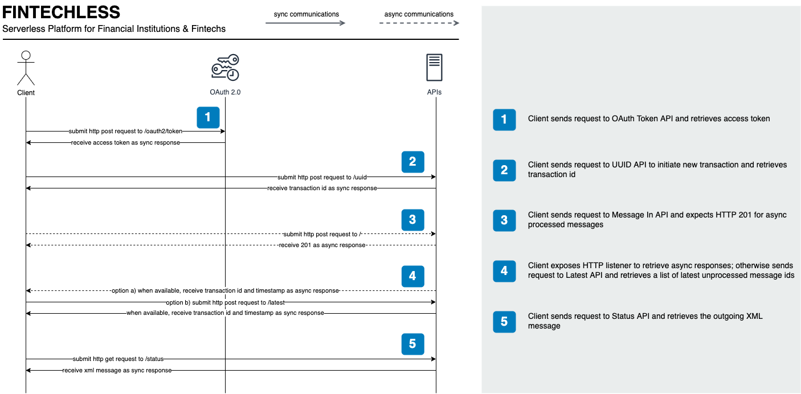

# Client Workflow



1. Client sends request to OAuth Token API and retrieves access token

```sh
curl -v "https://{auth_domain}/oauth2/token" \
  -X POST -d "grant_type=client_credentials" \
  -H "Content-Type: application/x-www-form-urlencoded" \
  -H "Authorization: Basic {base64(cognito_client_id:cognito_client_secret)}"
````

2. Client sends request to UUID API to initiate new transaction and retrieves transaction id

```sh
curl -v "https://{api_domain}/uuid" -X POST -d "" -H "Bearer: Token {access_token}"
````

3. Client sends request to Message In API

```sh
curl -v "https://{api_domain}" \
  -X POST -d @src/asset/pacs.008.001.10.xml \
  -H "X-Transaction-Id: {transaction_id}" \
  -H "Content-Type: application/xml" \
  -H "Bearer: Token {access_token}"
```

4. Client sends request to Latest API and retrieves a list of uncollected outgoing message ids

```sh
curl -v "https://{api_domain}/latest" -X POST -d "" -H "Bearer: Token {access_token}"
```

> NOTE: The platform can expose an SNS topic that once the client is subscribed,
will retrieve transaction id and timestamp as soon as it becomes available and
therefore avoiding making calls to Latest API

5. Client sends request to Status API and retrieves the outgoing XML message

```sh
curl -v "https://{api_domain}/status" \
  -X GET -d "transaction_id={transaction_id}&timestamp={timestamp}" \
  -H "Bearer: Token {access_token}"
```
