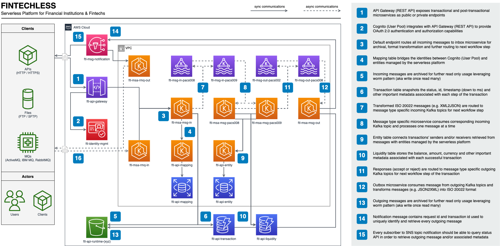

# Server Workflow

1. API Gateway exposes transactional and post-transactional microservices as public or private endpoints

2. Identity Platform integrates with API Gateway to provide OAuth 2.0 authentication and authorization capabilities

3. Default endpoint routes all incoming messages to incoming microservice for archival, format transformation and further routing to next workflow step

4. Mapping table bridges the identities between Identity Platform and entities managed by the serverless platform

5. Incoming messages are archived for further read only usage leveraging worm pattern (aka write once read many)

6. Transaction table snapshots the status, id, timestamp (down to ms) and other important metadata associated with each step of the transaction

7. Transformed ISO 20022 messages (e.g. XML2JSON) are routed to message type specific incoming Kafka topics for next workflow step

8. Message type specific microservice consumes corresponding incoming Kafka topic and processes one message at a time

9. Entity table connects transactions' senders and/or receivers retrieved from messages with entities managed by the serverless platform

10. Liquidity table stores the balance, amount, currency and other important metadata associated with each successful transaction

11. Responses (accept or reject) are routed to message type specific outgoing Kafka topics for next workflow step of the transaction

12. Outgoing microservice consumes message from outgoing Kafka topics and transforms messages (e.g. JSON2XML) into ISO 20022 format

13. Outgoing messages are archived for further read only usage leveraging worm pattern (aka write once read many)

14. Notification message contains request id and transaction id used to uniquely identify and retrieve every outgoing message

15. Every subscriber to SNS topic notification should be able to query Status API in order to retrieve outgoing message and/or associated metadata
